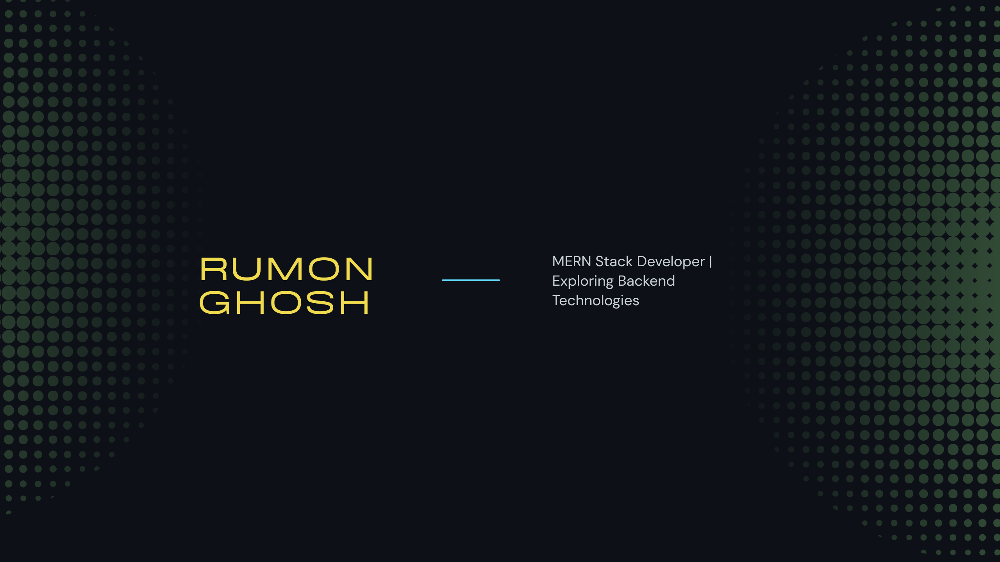

<!-- 🔥 Banner -->

<h1 align="center">Hi 👋, I'm Rumon Ghosh</h1>
<h3 align="center">A passionate MERN STACK Developer and learning-minded coder.</h3>

  

---

## 🧑‍💻 About Me
I'm a passionate **Frontend Developer** focused on building responsive and user-friendly web applications.  
Currently, I’m also learning backend technologies to become a **Full Stack Developer** soon.

---

## 🔥 Current Activities  
- 🌱 Currently learning: **Express.js, MongoDB & Next.js**  
- 💻 Working on: A **Ride Sharing Website**  
- 🚀 Exploring: Full Stack Development  
- 💬 Ask me about: **React.js, JavaScript, Firebase**

---

## 🌐 Connect with Me

📫 **Reach me at:** **rumon698@gmail.com**  
📍 **Location:** Cumilla, Chattogram, Bangladesh  

---

## 🛠 Languages & Tools

  
  
  
  
  
  
  
  
  
  
  
  
  
  

---

## 🏆 GitHub Achievements

  

---

## 📊 GitHub Stats

  
  

  

---

⭐ **Thanks for visiting my profile!**  
Feel free to connect — always open for collaboration!
